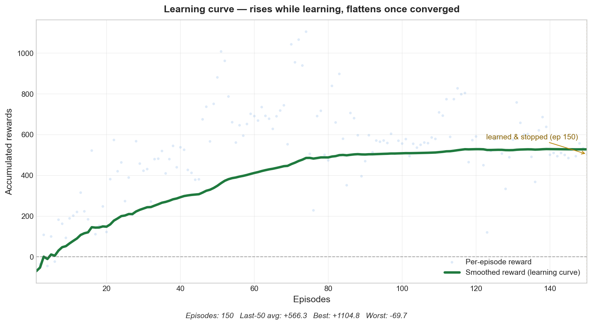
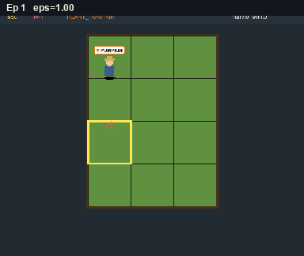

# Farm Q-Learning

A minimal visual Reinforcement-Learning demo: a pixel farmer learns to run a 3×4 farm using tabular Q-Learning.





## Run

```bash
python3 -m venv venv
source venv/bin/activate
pip install -r requirements.txt
python main.py
```

Produces `training.gif` (early vs. trained episode) and `training_progress.png` (learning curve).

### CLI options

```bash
python main.py --episodes 200 --seed 42        # reproducible 200-ep run
python main.py --no-render --episodes 1000     # headless: ~10× faster, no GIF
python main.py --save qtable.npy               # save Q-table after training
python main.py --load qtable.npy --episodes 50 # warm-start from a saved table
```

| Flag | Default | Purpose |
|---|---|---|
| `--episodes N` | 400 | number of training episodes |
| `--max-steps N` | 120 | steps per episode |
| `--seed N` | none | seed all RNGs for reproducible runs |
| `--no-render` | off | headless mode — no window, no GIF, much faster |
| `--save PATH` | none | save Q-table after training |
| `--load PATH` | none | load Q-table before training (warm start) |

## Files

| File | Purpose |
|---|---|
| `game.py` | constants, farm grid, farmer, `apply_action` — pure game logic |
| `agent.py` | tabular Q-Learning agent (ε-greedy, Bellman update, save/load) |
| `view.py` | pygame renderer + GIF recorder + matplotlib plot |
| `main.py` | `Trainer` class + CLI entry point |

## How it works

### State / actions
- State: `(cell_state, watered, money_bucket)` — only ~48 distinct states.
- Actions: `PLOW`, `PLANT_WHEAT`, `PLANT_CARROT`, `PLANT_PUMPKIN`, `WATER`, `HARVEST`, `MOVE`.
- Update: `Q[s][a] += α · (r + γ · max(Q[s']) − Q[s][a])`

### Training loop
Each episode runs `max-steps` (default 120) steps. The target cell is picked by a *shuffled cycle* over all 12 cells, so the farmer visits every plot evenly. The agent picks an action based on the cell's state, runs it, receives a reward, updates Q.

ε starts at 1.0 (pure exploration), decays ×0.97 each episode. Early stopping kicks in once the rolling mean plateaus (~episode 160).

### Rewards
- Successful action (plow/plant/water): +1
- Harvest: +10 / +20 / +40 (wheat / carrot / pumpkin)
- Illegal action for cell state: −1
- Crop wilted: −5
- Bankruptcy (money < 0): −20 and episode ends

## The learning curve

X = Episode, Y = Accumulated reward.

- **Green** segment: the last episode earned positive reward.
- **Red** segment: lost reward (exploration / wrong actions).
- Early episodes wiggle (red dips); once the policy stabilises the line becomes a clean green slope.
- Dotted vertical line marks where early-stopping triggered.

## Design notes (and known simplifications)

- The agent does **not** choose *where* to act — the cell is picked by `cell_cycle()`. The agent only chooses *what* action to take in the externally selected cell. This keeps the state space tiny (~48 states) and makes tabular Q-Learning tractable, but it is a deliberate simplification of the full RL problem.
- The state ignores crop type, time-to-ripen, and neighbour cells. Adding these would make the agent strictly more capable but require a larger Q-table or function approximation.
- World time advances on every action including `MOVE`, so "do nothing" is itself a time step.
